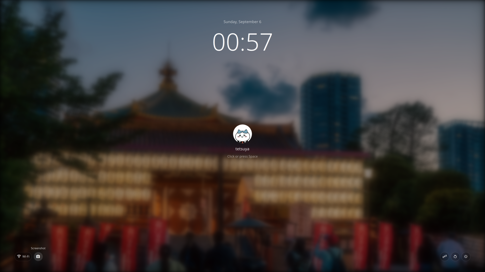

# Lock Screen

`Lock Screen` is an Omarchy lock-screen plugin that keeps Omarchy's
native locking implementation and replaces only the visual interface.



## Features

- Native Omarchy `WlSessionLock` session locking.
- Native Omarchy password PAM and fingerprint PAM authentication.
- Native `Super+Ctrl+L` shortcut through the `omarchy.lock` clone mechanism.
- Native screen stabilization, background loading, wake, and blanking behavior.
- A minimal lock-screen interface with the current wallpaper, time, date, avatar,
  username, and password entry.
- No network, battery, screenshot, sleep, restart, shutdown, or hibernate controls
  are shown in the lock-screen interface.
- Avatar lookup in this order: AccountsService, `~/.face`, `~/.face.icon`, then
  the built-in Nerd Font fallback icon.
- Optional lock-screen blank delay through `~/.config/omarchy/lock-screen.json`;
  the default is 5 seconds.

The plugin does not create a second lock daemon, replace PAM configuration, or
implement a separate authentication flow. Enabling it disables the built-in
`omarchy.lock` service; disabling it restores the built-in service.

## Installation and Removal

Install from an Omarchy plugin repository:

```sh
omarchy plugin add https://github.com/iamcheyan/omarchy-lock-screen.git --enable
```

After enabling, press `Super+Ctrl+L` to open the lock screen. Disable the
plugin to return to the native Omarchy lock-screen interface:

```sh
omarchy plugin disable iamcheyan.lock-screen
```

To remove the plugin completely:

```sh
omarchy plugin remove iamcheyan.lock-screen
```

## Avatar

The simplest per-user avatar is:

```sh
cp your-avatar.png ~/.face
```

The plugin checks the following locations in order:

1. `/var/lib/AccountsService/icons/<username>`
2. `~/.face`
3. `~/.face.icon`
4. Nerd Font default avatar

The selected image is cropped into the original circular avatar frame.

## Optional blank delay

The lock screen blanks the display after five seconds by default. To change it,
create `~/.config/omarchy/lock-screen.json`:

```json
{
  "blankDelaySeconds": 30
}
```

If the file is absent or invalid, the plugin uses the five-second default.

## Native integration

The plugin is declared as a clone of `omarchy.lock` and keeps the native
`Service.qml` lifecycle as its baseline. The service continues to own:

- `WlSessionLock` and secure lock-screen lifecycle;
- password authentication through `omarchy-lock-password`;
- fingerprint authentication through `omarchy-lock-fingerprint`;
- monitor stabilization, background refresh, wake, and lock lifecycle;
- the native `lock` IPC target used by `omarchy-system-lock`.

The UI calls Omarchy's existing commands for sleep, restart, shutdown, and
fullscreen screenshots. Screenshots use Omarchy's normal destination, usually
`~/Pictures/`, and keep its filename and notification behavior.

## Validation

```sh
omarchy plugin validate .
```

## License

MIT. See [LICENSE](LICENSE).

---

# 中文说明：Lock Screen

`Lock Screen` 是一个 Omarchy 锁屏插件。它保留 Omarchy 原生的锁屏实现，只替换锁屏界面外观。


## 功能

- 使用 Omarchy 原生 `WlSessionLock` 会话锁屏。
- 使用 Omarchy 原生密码 PAM 和指纹 PAM 认证。
- 通过 clone `omarchy.lock` 接管系统原生 `Super+Ctrl+L` 快捷键。
- 保留原生屏幕稳定等待、背景加载、唤醒和息屏逻辑。
- 提供包含当前壁纸、时间、日期、头像、用户名和密码输入的简洁锁屏界面。
- 不显示网络、电池、截图、睡眠、重启、关机或休眠按钮。
- 头像按以下顺序查找：AccountsService、`~/.face`、`~/.face.icon`、Nerd Font 默认头像。
- 可通过 `~/.config/omarchy/lock-screen.json` 设置锁屏后的息屏延迟，默认 5 秒。

插件不会创建第二个锁屏守护进程，不会修改 PAM 配置，也不会实现另一套认证逻辑。启用插件时会自动禁用 `omarchy.lock`；禁用插件后会恢复原生服务。

## 安装与卸载

```sh
omarchy plugin add https://github.com/iamcheyan/omarchy-lock-screen.git --enable
```

启用后按下 `Super+Ctrl+L` 即可打开锁屏。恢复 Omarchy 原生锁屏：

```sh
omarchy plugin disable iamcheyan.lock-screen
```

完全移除插件：

```sh
omarchy plugin remove iamcheyan.lock-screen
```

## 设置头像

最简单的用户头像设置方式是：

```sh
cp your-avatar.png ~/.face
```

插件会按以下顺序读取：

1. `/var/lib/AccountsService/icons/<用户名>`
2. `~/.face`
3. `~/.face.icon`
4. Nerd Font 默认头像

头像会被裁切到原来的圆形头像框中。

## 可选的息屏延迟

锁屏后默认等待 5 秒关闭屏幕。可以创建 `~/.config/omarchy/lock-screen.json`：

```json
{
  "blankDelaySeconds": 30
}
```

如果文件不存在或内容无效，插件会使用默认的 5 秒。

## 与 Omarchy 原生实现的关系

插件声明为 `omarchy.lock` 的 clone，并以原生 `Service.qml` 生命周期为基线。以下功能仍由服务负责：

- `WlSessionLock` 和安全锁屏生命周期；
- `omarchy-lock-password` 密码认证；
- `omarchy-lock-fingerprint` 指纹认证；
- 屏幕稳定等待、背景刷新、唤醒和锁屏生命周期；
- `omarchy-system-lock` 使用的原生 `lock` IPC 入口。

## 与 Shizuka SDDM 主题的一一对应关系

本插件的 `LockView.qml` 与
`/home/tetsuya/development/shizuka/Main.qml` 可以共享视觉方向：
`LockView.qml` 用于 Quickshell 锁屏，`Main.qml` 用于 SDDM 登录界面。修改视觉
设计时优先保持两者的主要布局和间距一致。

以下内容属于建议共享的视觉规范：

- 中央布局结构和组件顺序；
- 头像尺寸、圆形遮罩、头像加载顺序；
- 用户名的字号、字重和位置；
- 提示文字、密码框、占位文字和提交图标；
- 日期、时间的字号、字重、间距和位置；
- 背景模糊、暗色遮罩、透明度和边框；
- 底部操作按钮的尺寸、图标、字体和间距。

对应文件：

- `LockView.qml`
- `/home/tetsuya/development/shizuka/Main.qml`

认证、用户模型、会话模型和系统操作接口可以根据运行环境使用不同实现，
但不应因此改变共享视觉参数。

睡眠、重启、关机和截图按钮调用 Omarchy 已有的系统命令。截图使用 Omarchy 的默认保存位置，通常是 `~/Pictures/`，并保留原生文件名和通知行为。

## 验证

```sh
omarchy plugin validate .
```

## 许可证

MIT，详见 [LICENSE](LICENSE)。

---

# 日本語：Lock Screen

`Lock Screen` は、Omarchy 標準のロック処理を維持したまま、ロック画面の見た目だけを置き換えるプラグインです。


## 主な機能

- Omarchy 標準の `WlSessionLock` セッションロック。
- Omarchy 標準のパスワード PAM と指紋 PAM 認証。
- `omarchy.lock` の clone として、標準の `Super+Ctrl+L` を使用。
- 標準の画面安定化、背景読み込み、wake、画面消灯処理を維持。
- 時刻、日付、アバター、パスワード入力を備えたテーマ対応画面。
- 左下にバッテリー、ネットワーク、指紋の状態を表示。
- Omarchy 標準のスリープ、再起動、シャットダウン、全画面スクリーンショットを使用。
- アバターは AccountsService、`~/.face`、`~/.face.icon`、Nerd Font の順で検索。
- `~/.config/omarchy/lock-screen.json` で画面消灯までの時間を設定できます。標準値は 5 秒です。

別のロックデーモン、別の PAM 設定、別の認証フローは追加しません。プラグインを有効にすると `omarchy.lock` が自動的に無効になり、無効化すると標準サービスに戻ります。

## インストールと削除

```sh
omarchy plugin add https://github.com/iamcheyan/omarchy-lock-screen.git --enable
```

有効化後、`Super+Ctrl+L` でロック画面を開きます。標準画面へ戻すには：

```sh
omarchy plugin disable iamcheyan.lock-screen
```

プラグインを完全に削除するには：

```sh
omarchy plugin remove iamcheyan.lock-screen
```

## アバター

ユーザーごとのアバターは、次のように設定できます。

```sh
cp your-avatar.png ~/.face
```

検索順序は次のとおりです。

1. `/var/lib/AccountsService/icons/<ユーザー名>`
2. `~/.face`
3. `~/.face.icon`
4. Nerd Font のデフォルトアイコン

画像は元の円形フレームに合わせて円形に切り抜かれます。

## オプションの画面消灯遅延

ロック後は標準で 5 秒後に画面を消灯します。変更する場合は
`~/.config/omarchy/lock-screen.json` を作成します。

```json
{
  "blankDelaySeconds": 30
}
```

ファイルがない場合や内容が無効な場合は、5 秒の標準値が使われます。

## Omarchy 標準機能との統合

このプラグインは `omarchy.lock` の clone であり、現在の標準 `Service.qml` を変更せずに使用します。`WlSessionLock`、PAM 認証、指紋認証、画面安定化、背景更新、wake、画面消灯、`lock` IPC はすべて標準サービスが担当します。

スリープ、再起動、シャットダウン、スクリーンショットの操作には Omarchy の既存コマンドを使用します。スクリーンショットは通常 `~/Pictures/` に保存され、標準のファイル名と通知動作が維持されます。

## 検証

```sh
omarchy plugin validate .
```

## ライセンス

MIT。詳細は [LICENSE](LICENSE) を参照してください。
